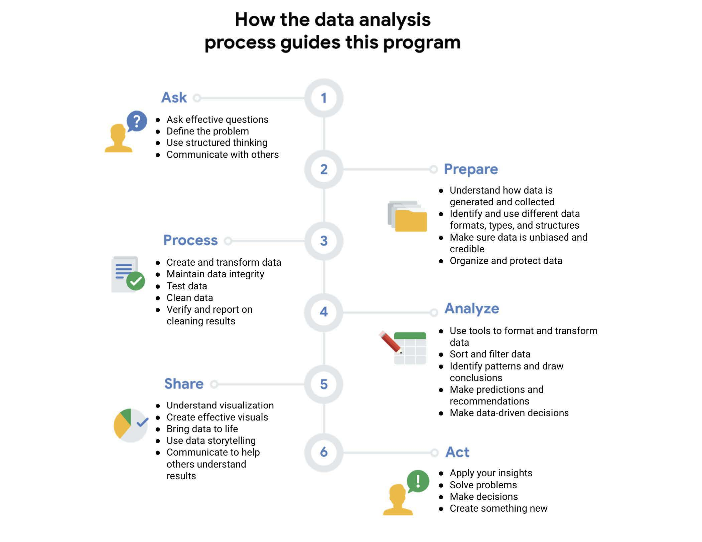

# Major Crime Indicators Analysis

This is personal portfolio project by Thamilini P.

This project focuses on major crime trends in Toronto. The Major Crime Indicators (MCI) are categorized under Assault, Break and Enter, Auto Theft, Robbery and Theft Over. 

## Purpose/Objective
Analyze trends in Major Crime Indicator (MCI) data to help recommend crime reduction strategies.

## Datasets License

The crime dataset used was made available by [Toronto Police Service Public Safety Data Portal](https://data.torontopolice.on.ca/datasets/TorontoPS::major-crime-indicators-1/about) under the [Open Government Licence - Ontario](https://www.ontario.ca/page/open-government-licence-ontario)

## Methodology

The datasets were cleaned, processed and transformed using R. The following libraries were used:
* tidyverse
* skimr
* janitor
* lubridate
* ggplot2

A dashboard and its visualizations were created using Tableau. 

Below is an image that outlines the phases used in this process. Image Source: [Google Data Analytics Professional Certificate Program](https://www.coursera.org/professional-certificates/google-data-analytics)

